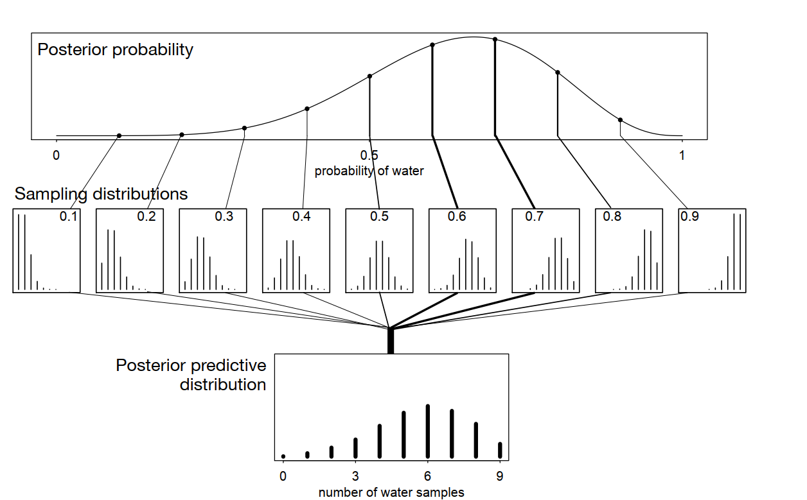
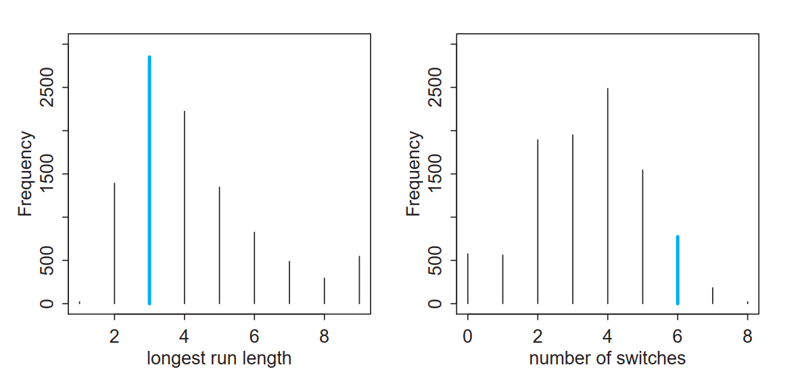
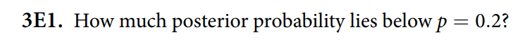
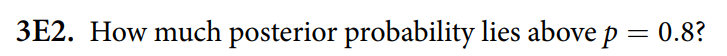
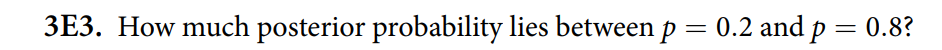
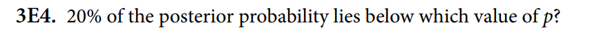
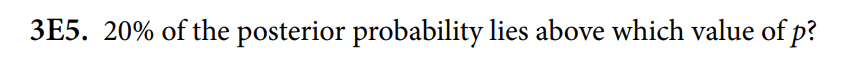
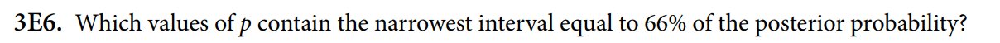
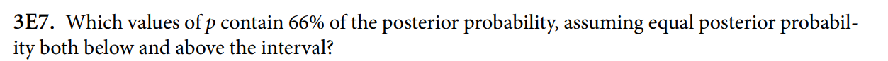

# 3.1. Sampling from a grid-approximate posterior

```{r}
p_grid <- seq(from = 0, to = 1, length.out = 1000) # これが関心のある値（たとえば「海」の割合など）
prob_p <- rep(1, 1000) # 事前確率
prob_data <- dbinom(6, size = 9, prob = p_grid) # probの違いによって、手元のデータの出やすさはどうちがうか
posterior <- prob_data * prob_p # 事後分布を求める
posterior <- posterior / sum(posterior) # 正規化
```

このposteriorを使って、p_gridから10,000個のサンプルを引き出す

```{r}
samples <- sample(p_grid, prob = posterior, size = 1e4, replace = TRUE)
plot(samples)
```

```{r}
library(rethinking)
dens(samples)
```

0.6に近いところで密度が高くなっている。これは、グリッド近似で求めた理想的なposterioの分布をとても似ている。

```{r}
plot(p_grid, posterior)

```

サンプルの数をもっと増やすと、ますます似てくる。

```{r}
samples <- sample(p_grid, prob = posterior, size = 1e6, replace = TRUE)
dens(samples)
```

# 3.2. Sampling to summarize

事後分布を要約する方法を考えてみよう。

## 3.2.1. Intervals of defined boundaries

```{r}
sum(posterior[p_grid < 0.5])
```

pの値が0.5未満になる確率はこんな風に求められる。簡単だ。ただ、これはグリッド近似だからで、たいていの場合はこんなに簡単ではない。

そこでサンプルを使うのだ。これなら、単にpの値が0.5未満のサンプルの数を足し合わせて、サンプル総数で割ればいいだけだ。

```{r}
samples <- sample(p_grid, prob = posterior, size = 1e4, replace = TRUE)
sum(samples < 0.5) / length(samples)
```

```{r}
samples <- sample(p_grid, prob = posterior, size = 1e4, replace = TRUE)
sum(samples > 0.5 & samples < 0.75) / length(samples)
```

0.5 \< p \< 0.75の確率も簡単に求められる

## 3.2.2. Intervals of defined mass

信頼区間confidence intervalというのがある

事後確率の区間の場合は、credible intervalとでも呼べるかもしれない。

だけどここでは両立区間compatibility intervalと呼んでおこう。

両立というのは、モデルとデータが両立するということだ。モデルとデータが両立するパラメータの範囲を示すのが両立区間だ。

この種の区間を扱うには、グリッド近似を使うよりも、事後分布からのサンプルを使った方が簡単だ。

たとえば、下側80％の事後確率の境界を知りたいとしよう。

```{r}
quantile(samples, 0.8)
```

あるいは、10%から90%の範囲の境界を求めたいとしよう。

```{r}
quantile(samples, c(0.1, 0.9))
```

この種の区間、つまり両端（左右の尾）に等しい確率質量を割り当てる区間は、科学文献で非常によく使われている。これを**パーセンタイル区間（PI）**と呼ぶことにする。これらの区間は、分布の形を伝えるうえでは有用である（ただし、分布があまり非対称でない場合に限る）。しかし、どのパラメータがデータと整合的であるかについて推論を支えるという点では、完全ではない。

図3.3に示された事後分布とさまざまな区間を考えてみよう。この事後分布は、3回の試行で3回とも水（成功）が観測され、かつ一様（フラット）な事前分布を仮定した場合に対応している。この分布は非常に歪んでおり、最大値は境界である p=1 にある。

この分布は、グリッド近似によって計算することができる：

```{r}
p_grid <- seq(from = 0, to = 1, length.out = 1000)
prior <- rep(1, 1000)
likelihood <- dbinom(3, size = 3, prob = p_grid)
posterior <- likelihood * prior
posterior <- posterior / sum(posterior)
samples <- sample(p_grid, size = 1e4, replace = TRUE, prob = posterior)
```

```{r}
PI(samples, prob = 0.5)
```

この区間は、区間の上側と下側にそれぞれ25%の確率質量を割り当てる。したがって、中央の50%の確率を示している。しかしこの例では、もっとも確率の高いパラメータ値、つまり p=1 付近の値を除外してしまう。そのため、事後分布の形を記述するという点では――これらの区間に求められているのは本来それだけなのだが――パーセンタイル区間は誤解を招くことがある。

それに対して、図3.3の右側のプロットは、50%の最高事後密度区間、HPDIを示している。HPDIとは、指定された確率質量を含むもっとも狭い区間である。考えてみれば、同じ確率質量をもつ事後区間は無数に存在するはずである。しかし、データともっとも整合的なパラメータ値をもっともよく表す区間がほしいなら、そのような区間のうち、もっとも密度の高い区間が必要になる。それがHPDIである。サンプルからHPDIを計算するには、HPDI を使う。これは rethinking パッケージの一部でもある。

```{r}
HPDI(samples, prob = 0.5)
```

この区間は、事後確率が最も高いパラメータを含んでおり、しかも明らかにより狭い。幅は0.23のパーセンタイル区間に対して、0.16である。

したがって、HPDIはPIに対していくつかの利点を持っている。しかし多くの場合、これら2種類の区間は非常によく似ている。この例でこれほど違って見えるのは、事後分布が非常に歪んでいるからにすぎない。もし代わりに、9回の試行で6回成功した場合の事後分布を使えば、これらの区間はほぼ同一になるだろう。自分でも試してみるとよい。例えば、確率質量を0.8や0.95に変えてみるとよい。事後分布がベル型（正規分布のような形）であれば、どの種類の区間を使うかはほとんど問題にならない。私たちはロケットを打ち上げたり粒子加速器を調整したりしているわけではないのだから、小数点第5位までの精度にこだわっても、科学的成果は向上しない。

HPDIには欠点もある。HPDIはPIよりも計算コストが高く、またシミュレーション分散が大きい。これは、事後分布からどれくらいのサンプルを取るかに結果が敏感である、という意味である。また理解するのもやや難しく、多くの科学者にとってはその特徴が直感的ではない。一方でパーセンタイル区間はすぐに理解される。というのも、通常の（非ベイズ的な）区間推定は、しばしば（誤って）パーセンタイル区間のように解釈されているからである（ただし下のRethinkingボックスを参照）。

全体として、区間の種類の選択が大きな違いを生むのであれば、そもそも区間で事後分布を要約すべきではない。忘れてはいけないのは、ベイズにおける「推定値」とは事後分布そのものだということである。それは、パラメータの取りうる各値の相対的な尤もらしさを要約している。分布の区間は、それを要約するための補助的な道具にすぎない。もし区間の選び方によって異なる推論が導かれてしまうなら、事後分布全体をプロットした方がよい。

### 3.2.3. Point estimates

事後分布に対する3つ目で最後の一般的な要約方法は、何らかの点推定を作ることである。事後分布全体が与えられているとき、どの値を報告すべきだろうか？これは一見すると単純な問いに見えるが、実際には答えるのが難しい。

ベイズ的なパラメータ推定とは、まさに事後分布そのものであり、それは単一の数値ではなく、各パラメータ値に対してその尤もらしさを対応づける関数である。したがって本当に重要なのは、点推定を選ぶ必要はないという点である。点推定はほとんどの場合必要なく、しばしば有害ですらある。なぜなら、情報を捨ててしまうからである。

しかし、それでも事後分布を1つの値で要約しなければならない場合には、さらにいくつかの問いに答える必要がある。次の例を考えよう。図3.3と同様に、3回の試行で3回とも水が出たグローブ投げ実験を考える。ここでは3つの異なる点推定を検討する。まず、科学者がよく報告するのは、事後確率が最大となるパラメータ値、すなわち**MAP推定値（maximum a posteriori）**である。この例ではMAPは簡単に計算できる：

```{r}
p_grid[which.max(posterior)]
```

もし事後分布からのサンプルを持っているなら、同じ点を近似することもできる：

```{r}
chainmode(samples, adj=0.1)
```

しかし、なぜこの点、つまり最頻値（mode）が重要なのだろうか？なぜ事後平均や中央値を報告しないのだろうか？

```{r}
mean(samples)
median(samples)
```

これらも点推定であり、事後分布を要約している。しかしこの場合、3つ――最頻値（MAP）、平均、中央値――はすべて異なる。では、どれを選べばよいのだろうか？図3.4は、この事後分布とこれらの点推定の位置を示している。

事後分布全体を推定として使う以外の、原理的な方法の1つは、**損失関数（loss function）**を選ぶことである。損失関数とは、ある点推定を使ったときに生じるコストを定めるルールである。統計学者やゲーム理論の研究者は長い間、損失関数やそれを支えるベイズ推論に関心を持ってきたが、科学者がそれを明示的に使うことはほとんどない。重要な洞察は、異なる損失関数は異なる点推定を導くということである。

手続きを理解するための例を示そう。あなたに賭けを提案するとする。地球上の水の割合 p がどの値だと思うか答えてほしい。もし完全に正解すれば100ドル支払う。しかし、あなたの答えが正しい値から離れているほど、その距離に比例して賞金から差し引く。正確には、損失は ∣d−p∣ に比例する。ここで d はあなたの選択、p は正しい値である。金額の設定は変えてもよいが、この問題の本質は変わらない。重要なのは、損失が「真の値からの距離」に比例するという点である。

さて、事後分布が手元にあるとき、期待される利益を最大化するにはどうすればよいだろうか？実は、期待利益を最大化（＝期待損失を最小化）するパラメータ値は、事後分布の**中央値（median）**である。この事実を、数学的証明なしで確認してみよう。証明に興味がある人は巻末注を参照してほしい。

ある特定の意思決定に対する期待損失を計算するとは、真の値に関する不確実性を、事後分布を使って平均することを意味する。もちろん多くの場合、真の値はわからない。しかし、モデルがパラメータについて持っている情報を使うのであれば、それは事後分布全体を使うということである。そこで、意思決定として p=0.5 を選ぶとしよう。このとき期待損失は次のようになる：

```{r}
sum(posterior * abs(0.5 - p_grid))
```

posterior と p_grid は、この章でこれまで使ってきたものと同じであり、それぞれ事後確率とパラメータ値を含んでいる。上のコードがしていることは、重み付き平均としての損失を計算しているだけであり、各損失は対応する事後確率によって重み付けされている。この計算をすべての可能な意思決定について繰り返すためのちょっとした工夫として、sapply 関数を使うことができる。

```{r}
loss <- sapply(p_grid, function(d) sum(posterior * abs(d - p_grid)))
```

これで loss という変数には、各意思決定に対応する損失のリストが格納される（それぞれ p_grid の値に対応している）。ここから、損失を最小にするパラメータ値を簡単に見つけることができる：

```{r}
plot(p_grid, loss)
```

```{r}
p_grid[which.min(loss)]
```

そして、これは実際に**事後中央値（posterior median）**である。つまり、事後分布の確率質量を上下に半分ずつ分けるパラメータ値である。比較のために median(samples) を試してみるとよい。サンプリング誤差のために完全に一致するとは限らないが、近い値になるはずである。

```{r}
median(samples)
```

では、これらすべてから何を学べばよいのだろうか？点推定、すなわち事後分布の単一の値による要約を決めるためには、損失関数を選ぶ必要がある。異なる損失関数は、異なる点推定を導く。最も一般的な2つの例は、上で見た絶対損失（中央値を導く）と、二乗損失 (d−p) 2 （事後平均、すなわち mean(samples) を導く）である。事後分布が対称で正規分布のような形をしている場合、中央値と平均は同じ値に収束するため、どの損失関数を選ぶかについての不安は和らぐ。例えば、もとのグローブ投げデータ（9回中6回成功）では、平均と中央値はほとんど違わない。

しかし原理的には、実際の文脈の詳細によっては、かなり特殊な損失関数が必要になることもある。例えば、ハリケーンの風速の推定に基づいて避難命令を出すかどうかを決める場合を考えよう。風速が上がると、生命や財産への被害は急激に増加する。一方で、不要な避難命令を出すことにもコストはあるが、それは比較的小さい。したがって、この場合の損失関数は強く非対称になる。真の風速が予測よりも高かった場合には損失は急激に増加するが、真の風速が予測より低かった場合の損失はゆるやかにしか増えない。このような状況では、最適な点推定は平均や中央値よりも大きな値になる傾向がある。さらに言えば、本当の問題は「避難命令を出すかどうか」であり、風速の点推定そのものは必ずしも必要ではない。

通常、研究者は損失関数についてあまり考えない。そのため、平均やMAPのような点推定を報告するとしても、それは特定の意思決定を支援するためではなく、事後分布の形を記述するためである。意思決定とは仮説を採択するかどうかだ、と主張することもできるかもしれない。しかしその場合には、得られる知識や失われる知識という観点から、どのようなコストと利益が関係するのかを明確にしなければならない。通常は、事後分布だけでなくデータやモデルそのものについて、できるだけ多くの情報を伝える方が望ましい。そうすることで他の研究者がその成果を発展させることができる。仮説の採択や棄却を早まると、命に関わる結果を招くことすらある。

これらの点を意識しておくことは健全である。というのも、統計的推論における多くの定型的な問いは、特定の経験的文脈や応用目的を考慮して初めて答えられるものだからである。統計学者は一般的な指針や標準的な答えを提供することはできるが、意欲的で注意深い科学者であれば、そうした一般的助言を常によりよいものに改善できるはずである。

# 3.3. Sampling to simulate prediction

サンプルのもう一つの重要な役割は、モデルが含意する観測データのシミュレーションを容易にすることである。モデルから「想定される観測データ」を生成することは、少なくとも次の4つ（実際には5つ）の理由で有用である。

(1) モデル設計（Model design） 事後分布だけでなく、事前分布からもサンプリングできる。データが来る前にモデルが何を予測しているかを見ることは、事前分布の含意を理解する最良の方法である。後の章では、多くのパラメータを扱うため、このような確認がより重要になる。

(2) モデルチェック（Model checking） データでモデルを更新した後、想定される観測データをシミュレーションすることで、モデルが適切にフィットしているか、またどのような振る舞いをするかを確認できる。

(3) ソフトウェア検証（Software validation） モデル推定のソフトウェアが正しく動いているか確認するために、既知のモデルからデータを生成し、そのデータから元のパラメータを復元できるかを試す。

(4) 研究デザイン（Research design） 仮説から観測データをシミュレーションできれば、その研究デザインが有効かどうかを評価できる。狭い意味では検出力分析（power analysis）だが、可能性はそれより広い。

(5) 予測（Forecasting） 推定結果を使って新しいケースや将来の観測をシミュレーションできる。これらは応用的な予測として有用であるだけでなく、モデルの批判や改良にも役立つ。

この章の最後では、シミュレーションによって観測データを生成する方法と、いくつかの簡単なモデルチェックの方法を扱う。

## 3.3.1. Dummy data

これまで2章にわたって扱ってきたグローブ投げモデルをまとめよう。水の真の割合 p が存在し、それが推論の対象である。地球儀を投げてキャッチすると、「水」と「陸」という観測が得られ、それぞれの出現割合は p と 1−p に対応する。

ここで重要なのは、これらの仮定が、観測後に p の各値の尤もらしさを推論できるだけでなく（これは前章で行ったこと）、モデルが含意する観測データをシミュレーションすることも可能にする点である。これは尤度関数が双方向に機能するからである。観測データが与えられれば、その尤もらしさを評価できる。一方で、パラメータだけが与えられれば、尤度関数は「どのような観測が起こりうるか」の分布を定義し、そこからサンプリングすることで観測をシミュレーションできる。この意味で、ベイズモデルは常に**生成的（generative）**であり、予測をシミュレーションする能力を持つ。非ベイズモデルでも生成的なものはあるが、そうでないものも多い。

このようにして生成されたデータを**ダミーデータ（dummy data）**と呼ぶ。これは実際のデータの代替物であることを示すための名称である。グローブ投げモデルでは、ダミーデータは二項分布から生成される：

ここで W は「水」の観測回数、N は試行回数である。たとえば N=2（2回投げる）とすると、可能な観測は3つだけになる：水が0回、1回、2回である。それぞれの確率は、任意の p に対して簡単に計算できる。ここでは p=0.7 を使おう。これは地球上の水の割合にだいたい対応する。

```{r}
dbinom(0:2, size = 2, prob = 0.7)
```

これは、w=0 が観測される確率が9%、w=1 が42%、w=2 が49%であることを意味する。もし p の値を変えれば、含意される観測の分布も変わる。

さて、これらの確率を使って観測をシミュレーションしてみよう。これは、先ほど説明した分布からサンプリングすることで行う。sample 関数を使ってもよいが、Rには二項分布のような標準的な確率分布に対する便利なサンプリング関数が用意されている。したがって、ダミーデータの1つの観測値 W は次のようにサンプリングできる：

```{r}
rbinom(1, size = 2, prob = 0.7)
```

この「1」は「2回の試行で水が1回」という意味である。rbinom の「r」は「random（ランダム）」を意味する。この関数は一度に複数のシミュレーションも生成できる。例えば、10回分のシミュレーションは次のように行える：

```{r}
rbinom(10, size = 2, prob = 0.7)
```

各値（0, 1, 2）が尤度に比例して現れることを確認するために、10万個のダミー観測を生成してみよう：

```{r}
dummy_w <- rbinom(1e5, size = 2, prob = 0.7)
table(dummy_w) / 1e5
```

これらの値は、先ほど解析的に計算した尤度に非常に近い。シミュレーション分散のために、わずかに異なる値になることがある。このコードを何度か実行して、シミュレーションごとに頻度がどのように変動するかを確認してみるとよい。

ただし、2回の試行ではサンプルサイズとしては小さい。そこで、以前と同じサンプルサイズである9回の試行をシミュレーションしてみよう：

```{r}
dummy_w <- rbinom(1e5, size = 9, prob = 0.7)
simplehist(dummy_w, xlab = "dummy water count")
```

この結果のプロットは図3.5に示されている。ほとんどの場合、観測値は真の割合0.7ちょうどにはならないことに注意しよう。これが観測の本質である。データとデータ生成過程の間には一対多の関係がある。上のコードにある size（サンプルサイズ）や prob の値を変えて、シミュレーションされた標本分布の形や位置がどのように変わるか試してみるとよい。

これで基本的な観測シミュレーションの方法はわかった。では、これにどんな意味があるのだろうか？これらのサンプルには多くの有用な使い道がある。この章では、モデルが含意する予測を調べるためにこれらを使う。しかしそのためには、事後分布からのサンプルと組み合わせる必要がある。それは次に扱う。

## 3.3.2. Model checking

モデルチェックとは、(1) モデル当てはめが正しく行われたかを確認すること、(2) モデルが特定の目的に対して十分に適切かを評価することを意味する。ベイズモデルは常に生成的であり、観測からパラメータを推定するだけでなく、観測をシミュレーションすることもできる。そのため、データで条件づけた後には、モデルの経験的な期待を調べるためにシミュレーションを行うことができる。

### 3.3.2.1 ソフトウェアは正しく動いたか？

最も単純な場合には、モデルが生成する予測（含意される観測）と、モデルを当てはめたデータとの対応を確認することで、ソフトウェアが正しく動いたかをチェックできる。このような予測は「レトロディクション（retrodictions）」と呼ぶこともできる。これは、モデルが学習に使ったデータをどれだけ再現できるかを問うものだからである。完全に一致することは期待されないし、望ましくもない。しかし、まったく対応が見られない場合には、ソフトウェアに何か問題がある可能性が高い。

ソフトウェアが完全に正しく動いていることを確実に保証する方法はない。レトロディクションが観測データと対応していても、微妙な誤りが潜んでいる可能性はある。また、多層モデルを扱うようになると、レトロディクションと観測の間にある程度のズレが生じるのはむしろ普通である。それでも、ここで紹介しているような単純なチェックは、誰もが時々犯すような単純なミスを見つけるのに役立つ。

グローブ投げの例では、モデルが非常に単純なので、解析的な結果と比較することでソフトウェアの正しさを確認できる。したがって、ここではモデルの適切性の検討に進むことにする。

### 3.3.2.2 モデルは適切か？

事後分布が正しく得られている（つまりソフトウェアが正しく動作している）と確認した後は、モデルの期待がうまく説明できていないデータの側面にも目を向けることが有用である。目的は、モデルの仮定が「真であるか」を検証することではない。なぜなら、すべてのモデルは誤っているからである。むしろ目的は、モデルがどのようにデータの説明に失敗しているかを明らかにすることであり、それがモデルの理解、修正、改良につながる。

すべてのモデルは何らかの点で失敗する。そのため、どの失敗が重要かどうかは、自分自身や同僚の判断に委ねられる。単に既存のデータを再現するだけのモデルを作りたい科学者はほとんどいない。したがって、不完全な予測（レトロディクション）は悪いことではない。通常は、将来の観測を予測するか、あるいは世界を有用に理解・操作できる程度の理解を得ることが目標である。これらの問題は第6章で再び扱う。

ここで必要なのは、前節で行ったような観測のシミュレーションと、事後分布からのパラメータのサンプリングを組み合わせる方法を学ぶことである。点推定だけでなく、事後分布全体を使った方が良い結果が得られると期待される。なぜか？それは、事後分布全体には不確実性に関する多くの情報が含まれているからである。単一のパラメータ値を取り出して計算すると、その情報は失われてしまう。この情報の喪失が、過信（overconfidence）を生む。

グローブ投げモデルについて、シミュレーションされた観測を使って基本的なモデルチェックを行ってみよう。この例では、観測は地球儀を投げたときの水の回数である。モデルが含意する予測には、2種類の不確実性があり、その両方を理解することが重要である。

第一に、観測の不確実性がある。パラメータ p が特定の値に固定されていたとしても、そのときにモデルが予測する観測にはばらつきがある。これらの観測パターンは、前章で見た「分岐するデータの庭（gardens of forking data）」と同じものであり、前節でサンプリングしたものでもある。たとえ p を正確に知っていたとしても、次の観測結果を確実に予測することはできない（ただし p=0 や p=1 の場合を除く）。

第二に、パラメータ p の不確実性がある。この不確実性は事後分布によって表現される。そして p に不確実性がある以上、それに依存するすべてのものにも不確実性が生じる。結果を評価する際には、このパラメータの不確実性と、観測のばらつき（サンプリング変動）が相互に作用する。

私たちは、このパラメータの不確実性を**伝播（propagate）**させたい。つまり、予測を評価する際にもそれを反映させるということである。そのためには、予測を計算する際に、事後分布にわたって平均を取ればよい。各パラメータ値 p に対して、それぞれ観測結果の分布がある。したがって、各 p における標本分布を計算し、それらを事後確率で重み付けして平均すれば、**事後予測分布（posterior predictive distribution）**が得られる。

図3.6は、この平均化の過程を示している。上段には事後分布が描かれており、10個の異なるパラメータ値が縦線で示されている。中段には、それぞれのパラメータ値に対応する観測の分布が示されている。どの p に対しても観測は確定的ではないが、p に応じて分布の位置は変化する。最後に下段では、すべての p に対する標本分布が統合され、各 p の事後確率を使って、各観測（0〜9回の水）の重み付き平均頻度が計算されている。

こうして得られる分布は予測のためのものであり、パラメータ p の事後分布に含まれる不確実性をすべて取り込んでいる。その結果、この分布は「正直」である。モデルはデータの予測にうまく対応しており、最も起こりやすい観測は実際の観測と一致しているが、それでも予測はかなり広がりを持っている。

もし代わりに、単一のパラメータ値（たとえば事後分布のピークにある最頻値）だけを使って予測を計算すると、過信した（overconfident）予測分布が得られることになる。それは図3.6の事後予測分布よりも狭くなり、中段で示されている p=0.6 の標本分布のような形に近くなる。このような過信は、モデルが実際以上にデータと整合的であると誤解させる原因となる。つまり、予測が観測の周りに不自然に集中してしまうのである。この錯覚は、パラメータの不確実性を捨ててしまうことによって生じる。

---
title: "chap3"
output: html_document
date: "2026-05-01"
---

# 3.1. Sampling from a grid-approximate posterior

```{r}
p_grid <- seq(from = 0, to = 1, length.out = 1000) # これが関心のある値（たとえば「海」の割合など）
prob_p <- rep(1, 1000) # 事前確率
prob_data <- dbinom(6, size = 9, prob = p_grid) # probの違いによって、手元のデータの出やすさはどうちがうか
posterior <- prob_data * prob_p # 事後分布を求める
posterior <- posterior / sum(posterior) # 正規化
```

このposteriorを使って、p_gridから10,000個のサンプルを引き出す

```{r}
samples <- sample(p_grid, prob = posterior, size = 1e4, replace = TRUE)
plot(samples)
```

```{r}
library(rethinking)
dens(samples)
```

0.6に近いところで密度が高くなっている。これは、グリッド近似で求めた理想的なposterioの分布をとても似ている。

```{r}
plot(p_grid, posterior)

```

サンプルの数をもっと増やすと、ますます似てくる。

```{r}
samples <- sample(p_grid, prob = posterior, size = 1e6, replace = TRUE)
dens(samples)
```

# 3.2. Sampling to summarize

事後分布を要約する方法を考えてみよう。

## 3.2.1. Intervals of defined boundaries

```{r}
sum(posterior[p_grid < 0.5])
```

pの値が0.5未満になる確率はこんな風に求められる。簡単だ。ただ、これはグリッド近似だからで、たいていの場合はこんなに簡単ではない。

そこでサンプルを使うのだ。これなら、単にpの値が0.5未満のサンプルの数を足し合わせて、サンプル総数で割ればいいだけだ。

```{r}
samples <- sample(p_grid, prob = posterior, size = 1e4, replace = TRUE)
sum(samples < 0.5) / length(samples)
```

```{r}
samples <- sample(p_grid, prob = posterior, size = 1e4, replace = TRUE)
sum(samples > 0.5 & samples < 0.75) / length(samples)
```

0.5 \< p \< 0.75の確率も簡単に求められる

## 3.2.2. Intervals of defined mass

信頼区間confidence intervalというのがある

事後確率の区間の場合は、credible intervalとでも呼べるかもしれない。

だけどここでは両立区間compatibility intervalと呼んでおこう。

両立というのは、モデルとデータが両立するということだ。モデルとデータが両立するパラメータの範囲を示すのが両立区間だ。

この種の区間を扱うには、グリッド近似を使うよりも、事後分布からのサンプルを使った方が簡単だ。

たとえば、下側80％の事後確率の境界を知りたいとしよう。

```{r}
quantile(samples, 0.8)
```

あるいは、10%から90%の範囲の境界を求めたいとしよう。

```{r}
quantile(samples, c(0.1, 0.9))
```

この種の区間、つまり両端（左右の尾）に等しい確率質量を割り当てる区間は、科学文献で非常によく使われている。これを**パーセンタイル区間（PI）**と呼ぶことにする。これらの区間は、分布の形を伝えるうえでは有用である（ただし、分布があまり非対称でない場合に限る）。しかし、どのパラメータがデータと整合的であるかについて推論を支えるという点では、完全ではない。

図3.3に示された事後分布とさまざまな区間を考えてみよう。この事後分布は、3回の試行で3回とも水（成功）が観測され、かつ一様（フラット）な事前分布を仮定した場合に対応している。この分布は非常に歪んでおり、最大値は境界である p=1 にある。

この分布は、グリッド近似によって計算することができる：

```{r}
p_grid <- seq(from = 0, to = 1, length.out = 1000)
prior <- rep(1, 1000)
likelihood <- dbinom(3, size = 3, prob = p_grid)
posterior <- likelihood * prior
posterior <- posterior / sum(posterior)
samples <- sample(p_grid, size = 1e4, replace = TRUE, prob = posterior)
```

```{r}
PI(samples, prob = 0.5)
```

この区間は、区間の上側と下側にそれぞれ25%の確率質量を割り当てる。したがって、中央の50%の確率を示している。しかしこの例では、もっとも確率の高いパラメータ値、つまり p=1 付近の値を除外してしまう。そのため、事後分布の形を記述するという点では――これらの区間に求められているのは本来それだけなのだが――パーセンタイル区間は誤解を招くことがある。

それに対して、図3.3の右側のプロットは、50%の最高事後密度区間、HPDIを示している。HPDIとは、指定された確率質量を含むもっとも狭い区間である。考えてみれば、同じ確率質量をもつ事後区間は無数に存在するはずである。しかし、データともっとも整合的なパラメータ値をもっともよく表す区間がほしいなら、そのような区間のうち、もっとも密度の高い区間が必要になる。それがHPDIである。サンプルからHPDIを計算するには、HPDI を使う。これは rethinking パッケージの一部でもある。

```{r}
HPDI(samples, prob = 0.5)
```

この区間は、事後確率が最も高いパラメータを含んでおり、しかも明らかにより狭い。幅は0.23のパーセンタイル区間に対して、0.16である。

したがって、HPDIはPIに対していくつかの利点を持っている。しかし多くの場合、これら2種類の区間は非常によく似ている。この例でこれほど違って見えるのは、事後分布が非常に歪んでいるからにすぎない。もし代わりに、9回の試行で6回成功した場合の事後分布を使えば、これらの区間はほぼ同一になるだろう。自分でも試してみるとよい。例えば、確率質量を0.8や0.95に変えてみるとよい。事後分布がベル型（正規分布のような形）であれば、どの種類の区間を使うかはほとんど問題にならない。私たちはロケットを打ち上げたり粒子加速器を調整したりしているわけではないのだから、小数点第5位までの精度にこだわっても、科学的成果は向上しない。

HPDIには欠点もある。HPDIはPIよりも計算コストが高く、またシミュレーション分散が大きい。これは、事後分布からどれくらいのサンプルを取るかに結果が敏感である、という意味である。また理解するのもやや難しく、多くの科学者にとってはその特徴が直感的ではない。一方でパーセンタイル区間はすぐに理解される。というのも、通常の（非ベイズ的な）区間推定は、しばしば（誤って）パーセンタイル区間のように解釈されているからである（ただし下のRethinkingボックスを参照）。

全体として、区間の種類の選択が大きな違いを生むのであれば、そもそも区間で事後分布を要約すべきではない。忘れてはいけないのは、ベイズにおける「推定値」とは事後分布そのものだということである。それは、パラメータの取りうる各値の相対的な尤もらしさを要約している。分布の区間は、それを要約するための補助的な道具にすぎない。もし区間の選び方によって異なる推論が導かれてしまうなら、事後分布全体をプロットした方がよい。

### 3.2.3. Point estimates

事後分布に対する3つ目で最後の一般的な要約方法は、何らかの点推定を作ることである。事後分布全体が与えられているとき、どの値を報告すべきだろうか？これは一見すると単純な問いに見えるが、実際には答えるのが難しい。

ベイズ的なパラメータ推定とは、まさに事後分布そのものであり、それは単一の数値ではなく、各パラメータ値に対してその尤もらしさを対応づける関数である。したがって本当に重要なのは、点推定を選ぶ必要はないという点である。点推定はほとんどの場合必要なく、しばしば有害ですらある。なぜなら、情報を捨ててしまうからである。

しかし、それでも事後分布を1つの値で要約しなければならない場合には、さらにいくつかの問いに答える必要がある。次の例を考えよう。図3.3と同様に、3回の試行で3回とも水が出たグローブ投げ実験を考える。ここでは3つの異なる点推定を検討する。まず、科学者がよく報告するのは、事後確率が最大となるパラメータ値、すなわち**MAP推定値（maximum a posteriori）**である。この例ではMAPは簡単に計算できる：

```{r}
p_grid[which.max(posterior)]
```

もし事後分布からのサンプルを持っているなら、同じ点を近似することもできる：

```{r}
chainmode(samples, adj=0.1)
```

しかし、なぜこの点、つまり最頻値（mode）が重要なのだろうか？なぜ事後平均や中央値を報告しないのだろうか？

```{r}
mean(samples)
median(samples)
```

これらも点推定であり、事後分布を要約している。しかしこの場合、3つ――最頻値（MAP）、平均、中央値――はすべて異なる。では、どれを選べばよいのだろうか？図3.4は、この事後分布とこれらの点推定の位置を示している。

事後分布全体を推定として使う以外の、原理的な方法の1つは、**損失関数（loss function）**を選ぶことである。損失関数とは、ある点推定を使ったときに生じるコストを定めるルールである。統計学者やゲーム理論の研究者は長い間、損失関数やそれを支えるベイズ推論に関心を持ってきたが、科学者がそれを明示的に使うことはほとんどない。重要な洞察は、異なる損失関数は異なる点推定を導くということである。

手続きを理解するための例を示そう。あなたに賭けを提案するとする。地球上の水の割合 p がどの値だと思うか答えてほしい。もし完全に正解すれば100ドル支払う。しかし、あなたの答えが正しい値から離れているほど、その距離に比例して賞金から差し引く。正確には、損失は ∣d−p∣ に比例する。ここで d はあなたの選択、p は正しい値である。金額の設定は変えてもよいが、この問題の本質は変わらない。重要なのは、損失が「真の値からの距離」に比例するという点である。

さて、事後分布が手元にあるとき、期待される利益を最大化するにはどうすればよいだろうか？実は、期待利益を最大化（＝期待損失を最小化）するパラメータ値は、事後分布の**中央値（median）**である。この事実を、数学的証明なしで確認してみよう。証明に興味がある人は巻末注を参照してほしい。

ある特定の意思決定に対する期待損失を計算するとは、真の値に関する不確実性を、事後分布を使って平均することを意味する。もちろん多くの場合、真の値はわからない。しかし、モデルがパラメータについて持っている情報を使うのであれば、それは事後分布全体を使うということである。そこで、意思決定として p=0.5 を選ぶとしよう。このとき期待損失は次のようになる：

```{r}
sum(posterior * abs(0.5 - p_grid))
```

posterior と p_grid は、この章でこれまで使ってきたものと同じであり、それぞれ事後確率とパラメータ値を含んでいる。上のコードがしていることは、重み付き平均としての損失を計算しているだけであり、各損失は対応する事後確率によって重み付けされている。この計算をすべての可能な意思決定について繰り返すためのちょっとした工夫として、sapply 関数を使うことができる。

```{r}
loss <- sapply(p_grid, function(d) sum(posterior * abs(d - p_grid)))
```

これで loss という変数には、各意思決定に対応する損失のリストが格納される（それぞれ p_grid の値に対応している）。ここから、損失を最小にするパラメータ値を簡単に見つけることができる：

```{r}
plot(p_grid, loss)
```

```{r}
p_grid[which.min(loss)]
```

そして、これは実際に**事後中央値（posterior median）**である。つまり、事後分布の確率質量を上下に半分ずつ分けるパラメータ値である。比較のために median(samples) を試してみるとよい。サンプリング誤差のために完全に一致するとは限らないが、近い値になるはずである。

```{r}
median(samples)
```

では、これらすべてから何を学べばよいのだろうか？点推定、すなわち事後分布の単一の値による要約を決めるためには、損失関数を選ぶ必要がある。異なる損失関数は、異なる点推定を導く。最も一般的な2つの例は、上で見た絶対損失（中央値を導く）と、二乗損失 (d−p) 2 （事後平均、すなわち mean(samples) を導く）である。事後分布が対称で正規分布のような形をしている場合、中央値と平均は同じ値に収束するため、どの損失関数を選ぶかについての不安は和らぐ。例えば、もとのグローブ投げデータ（9回中6回成功）では、平均と中央値はほとんど違わない。

しかし原理的には、実際の文脈の詳細によっては、かなり特殊な損失関数が必要になることもある。例えば、ハリケーンの風速の推定に基づいて避難命令を出すかどうかを決める場合を考えよう。風速が上がると、生命や財産への被害は急激に増加する。一方で、不要な避難命令を出すことにもコストはあるが、それは比較的小さい。したがって、この場合の損失関数は強く非対称になる。真の風速が予測よりも高かった場合には損失は急激に増加するが、真の風速が予測より低かった場合の損失はゆるやかにしか増えない。このような状況では、最適な点推定は平均や中央値よりも大きな値になる傾向がある。さらに言えば、本当の問題は「避難命令を出すかどうか」であり、風速の点推定そのものは必ずしも必要ではない。

通常、研究者は損失関数についてあまり考えない。そのため、平均やMAPのような点推定を報告するとしても、それは特定の意思決定を支援するためではなく、事後分布の形を記述するためである。意思決定とは仮説を採択するかどうかだ、と主張することもできるかもしれない。しかしその場合には、得られる知識や失われる知識という観点から、どのようなコストと利益が関係するのかを明確にしなければならない。通常は、事後分布だけでなくデータやモデルそのものについて、できるだけ多くの情報を伝える方が望ましい。そうすることで他の研究者がその成果を発展させることができる。仮説の採択や棄却を早まると、命に関わる結果を招くことすらある。

これらの点を意識しておくことは健全である。というのも、統計的推論における多くの定型的な問いは、特定の経験的文脈や応用目的を考慮して初めて答えられるものだからである。統計学者は一般的な指針や標準的な答えを提供することはできるが、意欲的で注意深い科学者であれば、そうした一般的助言を常によりよいものに改善できるはずである。

# 3.3. Sampling to simulate prediction

サンプルのもう一つの重要な役割は、モデルが含意する観測データのシミュレーションを容易にすることである。モデルから「想定される観測データ」を生成することは、少なくとも次の4つ（実際には5つ）の理由で有用である。

(1) モデル設計（Model design） 事後分布だけでなく、事前分布からもサンプリングできる。データが来る前にモデルが何を予測しているかを見ることは、事前分布の含意を理解する最良の方法である。後の章では、多くのパラメータを扱うため、このような確認がより重要になる。

(2) モデルチェック（Model checking） データでモデルを更新した後、想定される観測データをシミュレーションすることで、モデルが適切にフィットしているか、またどのような振る舞いをするかを確認できる。

(3) ソフトウェア検証（Software validation） モデル推定のソフトウェアが正しく動いているか確認するために、既知のモデルからデータを生成し、そのデータから元のパラメータを復元できるかを試す。

(4) 研究デザイン（Research design） 仮説から観測データをシミュレーションできれば、その研究デザインが有効かどうかを評価できる。狭い意味では検出力分析（power analysis）だが、可能性はそれより広い。

(5) 予測（Forecasting） 推定結果を使って新しいケースや将来の観測をシミュレーションできる。これらは応用的な予測として有用であるだけでなく、モデルの批判や改良にも役立つ。

この章の最後では、シミュレーションによって観測データを生成する方法と、いくつかの簡単なモデルチェックの方法を扱う。

## 3.3.1. Dummy data

これまで2章にわたって扱ってきたグローブ投げモデルをまとめよう。水の真の割合 p が存在し、それが推論の対象である。地球儀を投げてキャッチすると、「水」と「陸」という観測が得られ、それぞれの出現割合は p と 1−p に対応する。

ここで重要なのは、これらの仮定が、観測後に p の各値の尤もらしさを推論できるだけでなく（これは前章で行ったこと）、モデルが含意する観測データをシミュレーションすることも可能にする点である。これは尤度関数が双方向に機能するからである。観測データが与えられれば、その尤もらしさを評価できる。一方で、パラメータだけが与えられれば、尤度関数は「どのような観測が起こりうるか」の分布を定義し、そこからサンプリングすることで観測をシミュレーションできる。この意味で、ベイズモデルは常に**生成的（generative）**であり、予測をシミュレーションする能力を持つ。非ベイズモデルでも生成的なものはあるが、そうでないものも多い。

このようにして生成されたデータを**ダミーデータ（dummy data）**と呼ぶ。これは実際のデータの代替物であることを示すための名称である。グローブ投げモデルでは、ダミーデータは二項分布から生成される：

ここで W は「水」の観測回数、N は試行回数である。たとえば N=2（2回投げる）とすると、可能な観測は3つだけになる：水が0回、1回、2回である。それぞれの確率は、任意の p に対して簡単に計算できる。ここでは p=0.7 を使おう。これは地球上の水の割合にだいたい対応する。

```{r}
dbinom(0:2, size = 2, prob = 0.7)
```

これは、w=0 が観測される確率が9%、w=1 が42%、w=2 が49%であることを意味する。もし p の値を変えれば、含意される観測の分布も変わる。

さて、これらの確率を使って観測をシミュレーションしてみよう。これは、先ほど説明した分布からサンプリングすることで行う。sample 関数を使ってもよいが、Rには二項分布のような標準的な確率分布に対する便利なサンプリング関数が用意されている。したがって、ダミーデータの1つの観測値 W は次のようにサンプリングできる：

```{r}
rbinom(1, size = 2, prob = 0.7)
```

この「1」は「2回の試行で水が1回」という意味である。rbinom の「r」は「random（ランダム）」を意味する。この関数は一度に複数のシミュレーションも生成できる。例えば、10回分のシミュレーションは次のように行える：

```{r}
rbinom(10, size = 2, prob = 0.7)
```

各値（0, 1, 2）が尤度に比例して現れることを確認するために、10万個のダミー観測を生成してみよう：

```{r}
dummy_w <- rbinom(1e5, size = 2, prob = 0.7)
table(dummy_w) / 1e5
```

これらの値は、先ほど解析的に計算した尤度に非常に近い。シミュレーション分散のために、わずかに異なる値になることがある。このコードを何度か実行して、シミュレーションごとに頻度がどのように変動するかを確認してみるとよい。

ただし、2回の試行ではサンプルサイズとしては小さい。そこで、以前と同じサンプルサイズである9回の試行をシミュレーションしてみよう：

```{r}
dummy_w <- rbinom(1e5, size = 9, prob = 0.7)
simplehist(dummy_w, xlab = "dummy water count")
```

この結果のプロットは図3.5に示されている。ほとんどの場合、観測値は真の割合0.7ちょうどにはならないことに注意しよう。これが観測の本質である。データとデータ生成過程の間には一対多の関係がある。上のコードにある size（サンプルサイズ）や prob の値を変えて、シミュレーションされた標本分布の形や位置がどのように変わるか試してみるとよい。

これで基本的な観測シミュレーションの方法はわかった。では、これにどんな意味があるのだろうか？これらのサンプルには多くの有用な使い道がある。この章では、モデルが含意する予測を調べるためにこれらを使う。しかしそのためには、事後分布からのサンプルと組み合わせる必要がある。それは次に扱う。

## 3.3.2. Model checking

モデルチェックとは、(1) モデル当てはめが正しく行われたかを確認すること、(2) モデルが特定の目的に対して十分に適切かを評価することを意味する。ベイズモデルは常に生成的であり、観測からパラメータを推定するだけでなく、観測をシミュレーションすることもできる。そのため、データで条件づけた後には、モデルの経験的な期待を調べるためにシミュレーションを行うことができる。

### 3.3.2.1 ソフトウェアは正しく動いたか？

最も単純な場合には、モデルが生成する予測（含意される観測）と、モデルを当てはめたデータとの対応を確認することで、ソフトウェアが正しく動いたかをチェックできる。このような予測は「レトロディクション（retrodictions）」と呼ぶこともできる。これは、モデルが学習に使ったデータをどれだけ再現できるかを問うものだからである。完全に一致することは期待されないし、望ましくもない。しかし、まったく対応が見られない場合には、ソフトウェアに何か問題がある可能性が高い。

ソフトウェアが完全に正しく動いていることを確実に保証する方法はない。レトロディクションが観測データと対応していても、微妙な誤りが潜んでいる可能性はある。また、多層モデルを扱うようになると、レトロディクションと観測の間にある程度のズレが生じるのはむしろ普通である。それでも、ここで紹介しているような単純なチェックは、誰もが時々犯すような単純なミスを見つけるのに役立つ。

グローブ投げの例では、モデルが非常に単純なので、解析的な結果と比較することでソフトウェアの正しさを確認できる。したがって、ここではモデルの適切性の検討に進むことにする。

### 3.3.2.2 モデルは適切か？

事後分布が正しく得られている（つまりソフトウェアが正しく動作している）と確認した後は、モデルの期待がうまく説明できていないデータの側面にも目を向けることが有用である。目的は、モデルの仮定が「真であるか」を検証することではない。なぜなら、すべてのモデルは誤っているからである。むしろ目的は、モデルがどのようにデータの説明に失敗しているかを明らかにすることであり、それがモデルの理解、修正、改良につながる。

すべてのモデルは何らかの点で失敗する。そのため、どの失敗が重要かどうかは、自分自身や同僚の判断に委ねられる。単に既存のデータを再現するだけのモデルを作りたい科学者はほとんどいない。したがって、不完全な予測（レトロディクション）は悪いことではない。通常は、将来の観測を予測するか、あるいは世界を有用に理解・操作できる程度の理解を得ることが目標である。これらの問題は第6章で再び扱う。

ここで必要なのは、前節で行ったような観測のシミュレーションと、事後分布からのパラメータのサンプリングを組み合わせる方法を学ぶことである。点推定だけでなく、事後分布全体を使った方が良い結果が得られると期待される。なぜか？それは、事後分布全体には不確実性に関する多くの情報が含まれているからである。単一のパラメータ値を取り出して計算すると、その情報は失われてしまう。この情報の喪失が、過信（overconfidence）を生む。

グローブ投げモデルについて、シミュレーションされた観測を使って基本的なモデルチェックを行ってみよう。この例では、観測は地球儀を投げたときの水の回数である。モデルが含意する予測には、2種類の不確実性があり、その両方を理解することが重要である。

第一に、観測の不確実性がある。パラメータ p が特定の値に固定されていたとしても、そのときにモデルが予測する観測にはばらつきがある。これらの観測パターンは、前章で見た「分岐するデータの庭（gardens of forking data）」と同じものであり、前節でサンプリングしたものでもある。たとえ p を正確に知っていたとしても、次の観測結果を確実に予測することはできない（ただし p=0 や p=1 の場合を除く）。

第二に、パラメータ p の不確実性がある。この不確実性は事後分布によって表現される。そして p に不確実性がある以上、それに依存するすべてのものにも不確実性が生じる。結果を評価する際には、このパラメータの不確実性と、観測のばらつき（サンプリング変動）が相互に作用する。

私たちは、このパラメータの不確実性を**伝播（propagate）**させたい。つまり、予測を評価する際にもそれを反映させるということである。そのためには、予測を計算する際に、事後分布にわたって平均を取ればよい。各パラメータ値 p に対して、それぞれ観測結果の分布がある。したがって、各 p における標本分布を計算し、それらを事後確率で重み付けして平均すれば、**事後予測分布（posterior predictive distribution）**が得られる。

図3.6は、この平均化の過程を示している。上段には事後分布が描かれており、10個の異なるパラメータ値が縦線で示されている。中段には、それぞれのパラメータ値に対応する観測の分布が示されている。どの p に対しても観測は確定的ではないが、p に応じて分布の位置は変化する。最後に下段では、すべての p に対する標本分布が統合され、各 p の事後確率を使って、各観測（0〜9回の水）の重み付き平均頻度が計算されている。



こうして得られる分布は予測のためのものであり、パラメータ p の事後分布に含まれる不確実性をすべて取り込んでいる。その結果、この分布は「正直」である。モデルはデータの予測にうまく対応しており、最も起こりやすい観測は実際の観測と一致しているが、それでも予測はかなり広がりを持っている。

もし代わりに、単一のパラメータ値（たとえば事後分布のピークにある最頻値）だけを使って予測を計算すると、過信した（overconfident）予測分布が得られることになる。それは図3.6の事後予測分布よりも狭くなり、中段で示されている p=0.6 の標本分布のような形に近くなる。このような過信は、モデルが実際以上にデータと整合的であると誤解させる原因となる。つまり、予測が観測の周りに不自然に集中してしまうのである。この錯覚は、パラメータの不確実性を捨ててしまうことによって生じる。

では実際にどう計算するのか？単一のパラメータ値、例えば p=0.6p=0.6p=0.6 に対して予測をシミュレーションするには、`rbinom` を使ってランダムな二項分布のサンプルを生成すればよい：

```{r}
w <- rbinom(1e4, size = 9, prob = 0.6)
```

これは、p=0.6を仮定したもとで、9回のグローブ投げの結果を1万回シミュレーションすることを意味する。結果は水の回数として保存されるため、理論上の最小値は0、最大値は9である。`simplehist(w)`（rethinkingパッケージ）を使えば、シミュレーション結果のヒストグラムを簡単に描くことができる。

これらの予測にパラメータの不確実性を反映させるには、0.6という固定値の代わりに、事後分布からのサンプルを使えばよい：

```{r}
w <- rbinom(1e4, size = 9, prob = samples)
```

ここで `samples` は、これまで使ってきた事後分布からのランダムサンプルである。それぞれのサンプル値に対して、対応する二項分布から1つの観測が生成される。サンプルは事後確率に比例して現れるため、生成された観測も事後分布にわたって平均されたものになる。これらのシミュレーション結果は、事後分布のサンプルと同じように扱うことができ、区間や点推定を同じ手順で計算できる。これらをプロットすると、図3.6の右側に示された分布が得られる。

この場合、シミュレーションされたモデルの予測は観測データとかなり整合的である――実際の観測値である6は、シミュレーションされた分布のちょうど中央付近に位置している。予測にはかなりのばらつきがあるが、その多くは p の不確実性ではなく、二項過程そのものに由来している。それでも、このモデルが完全であると結論づけるのは時期尚早である。

これまで私たちは、データをあくまでモデルの見方に従って捉えてきた。すなわち、各試行（グローブ投げ）は完全に独立であると仮定している。しかし、この仮定は疑わしい。投げる人が十分に注意していなければ、連続する試行のあいだに相関が生じ、パターンが現れる可能性がある。例えば、地球（地球儀）の約半分は太平洋で覆われている。そのため、水と陸は均等に分布しているわけではなく、地球儀が空中で十分に回転しない場合、投げたときの位置が結果に影響する可能性がある。同様の問題はコイン投げでも生じ、熟練した人であれば物理的特性を利用して結果に影響を与えることができる。

モデルがどのような点で予測に失敗しているかを探るために、データを2つの異なる方法で見てみよう。9回の試行の列は W L W W W L W L W だったことを思い出そう。まず、水または陸のどちらかが連続して出た**最長連続長**を考える。これは試行間の相関の粗い指標になる。この観測データでは、最長連続長は水が3回である。次に、水から陸、あるいは陸から水へと切り替わる回数を考える。これもサンプル間の相関の指標である。観測データでは、切り替え回数は6回である。これらの新しい記述方法に特別な意味があるわけではなく、単にデータを別の観点から見るためのものである。自分のモデルでは、自分の目的に応じて重要なデータの側面を考える必要がある。

図3.7は、これら2つの観点で見たシミュレーション結果を示している。左側は最長連続長で、観測値3が太線で示されている。ここでも観測値はシミュレーションの中で最も一般的な値だが、かなりのばらつきがある。右側は切り替え回数で、観測値6が強調されている。この場合、シミュレーション結果はデータとあまり整合的ではなく、多くのシミュレーションでは観測よりも切り替え回数が少ない。これは試行間の独立性が成り立っていないことと整合的であり、各試行が前の試行と負の相関を持っていることを示唆している。



では、このことはモデルが悪いことを意味するのだろうか？それは状況による。モデルは常に何らかの意味で誤っており、仕様誤り（mis-specified）である。しかし、その誤りが重要かどうかは、目的によって異なる。この場合、もし試行が交互に切り替わる傾向があるなら、各試行は真の水の割合に関する情報をあまり多く含まないことになる。長期的には、この章で使ってきたような単純なモデルでも正しい割合に収束するが、事後分布が示唆するよりも遅いスピードで収束することになる。

# **再考：より極端（extreme）とは何か？**

観測データがモデルからどれだけ逸脱しているかを測る一般的な方法は、観測値とそれよりも「極端」な値を含む裾（tail）の確率を数えることである。通常の p 値は、このような裾確率の一例である。図3.6や図3.7のように、観測データとシミュレーションされた予測分布を比較するとき、どの程度裾に入ったらモデルが悪いと判断するべきか、という疑問が生じる。しかし統計的状況は多様であるため、普遍的な答えを与えることはできない。

さらに重要なのは、「極端」の定義には多くの方法があるという点である。通常の p 値は、モデルが期待するやり方でのみデータを見るため、モデルチェックとしては非常に弱い。例えば、図3.6の右端のプロットは、モデルにとって最も都合の良い形で適合度を評価している。これに対して、別の「極端」の定義を使えば、モデルにとってより厳しい検証になる可能性がある。図3.7で用いた異なる極端の定義は、より容易にモデルの問題を露呈させる。

モデルの当てはめ自体は客観的な手続きであり、誰がやっても同じベイズ更新が行われる。しかし、モデルチェックは本質的に主観的である。そしてこの主観性こそが強みでもある。なぜなら、現実世界に関する知識や専門性が、より創造的で有効なチェックを可能にするからである。ゴーレム（機械的な手続き）は想像力に乏しいため、私たちは自分自身の想像力を使う自由を持つ必要がある。このようにして、客観と主観が協働するのである。

# 3.4 要約

この章では、事後分布を扱うための基本的な手続きを導入した。私たちの基本的な道具は、事後分布から引いたパラメータのサンプルである。サンプルを使うことで、積分計算の問題をデータの要約の問題に変換できる。これらのサンプルは、区間推定、点推定、事後予測チェック、さらにはさまざまなシミュレーションに利用できる。

事後予測チェックは、事後分布が表すパラメータの不確実性と、尤度関数が表す結果の不確実性を組み合わせたものである。これらのチェックは、ソフトウェアが正しく動作したかを確認するのに役立つだけでなく、モデルがどのように不適切であるかを探るのにも有用である。

モデルがより複雑になると、事後予測シミュレーションはさらに広い用途で使われるようになる。モデルを理解するためにも、しばしば観測のシミュレーションが必要になる。この本では今後も、事後分布からのサンプルを使って、これらの作業をできるだけ簡単かつ柔軟に行えるようにしていく。

# 3.5 練習問題

```{r}
p_grid <- seq(from = 0, to = 1, length.out = 1000)
prior <- rep(1, 1000)
likelihood <- dbinom(6, size = 9, prob = p_grid)
posterior <- likelihood * prior
posterior <-  posterior / sum(posterior)
set.seed(100)
samples <- sample(p_grid, prob = posterior, size = 1e4, replace = TRUE)
```



```{r}
plot(samples)
```

```{r}
sum(samples < 0.2) / length(samples)
```



```{r}
sum(samples > 0.8) / length(samples)
```



```{r}
sum(samples > 0.2 & samples < 0.8) / length(samples)
```



```{r}
quantile(samples, 0.2)
```



```{r}
quantile(samples, 0.8)
```



```{r}
HPDI(samples, prob = 0.66)
```



```{r}
quantile(samples, c(0.17, 1 - 0.17))
```

**3M1.**\

グローブ投げのデータが「15回の試行で水が8回」だったとしよう。グリッド近似を用いて事後分布を構築せよ。事前分布はこれまでと同じ一様（フラット）なものを用いよ。

```{r}
p_grid <- seq(from = 0, to = 1, length.out = 1000)
prior <- rep(1, 1000)
likelihood <- dbinom(8, 15, prob = p_grid)
posterior <- likelihood * prior
posterior <- posterior / sum(posterior)

plot(p_grid, posterior, type = "l")
```

**3M2.**\

上で求めたグリッド近似から10,000個のサンプルを抽出せよ。その後、そのサンプルを用いて p の90% HPDIを計算せよ。

```{r}
samples <- sample(p_grid, prob = posterior, size = 1e4, replace = TRUE)

HPDI(samples, prob = 0.9)
```

**3M3.**\

このモデルとデータに対して、事後予測チェックを構築せよ。これは、p の事後分布における不確実性で平均をとりながら、サンプルの分布をシミュレーションすることを意味する。15回の試行で水が8回観測される確率はいくらか？

```{r}
# pをサンプリング
samples <- sample(p_grid, prob = posterior, size = 1e4, replace = TRUE)

# 各pで観測を生成
w_sim <- rbinom(1e4, size = 15, prob = samples)

hist(w_sim)

mean(w_sim == 8)
```

**3M4.**\

新しいデータ（15回中8回が水）から構築した事後分布を用いて、9回の試行で水が6回観測される確率を計算せよ。

```{r}
mean(rbinom(1e4, size = 9, prob = samples) == 6)

samples <- sample(p_grid, prob = posterior, size = 1e4, replace = TRUE)
w_sim <- rbinom(1e4, size = 9, prob = samples)
mean(w_sim == 6)
```

**3M5.**\

3M1からやり直しなさい。ただし今回は、p=0.5未満では0、p=0.5 以上では一定の値をとる事前分布を用いよ。これは、地球の表面の大部分が水であるという事前情報に対応している。上の各問題を繰り返し、推論結果を比較せよ。このより良い事前分布はどのような違いをもたらすか？必要であれば、両方の事前分布を用いた推論を真の値 p=0.7と比較せよ。

```{r}
p_grid <- seq(from = 0, to = 1, length.out = 1000)
prior <- ifelse(p_grid < 0.5, 0, 1)
likelihood <- dbinom(8, 15, prob = p_grid)
posterior <- likelihood * prior
posterior <- posterior / sum(posterior)

plot(p_grid, posterior, type = "l")
```

```{r}
samples <- sample(p_grid, prob = posterior, size = 1e4, replace = TRUE)

HPDI(samples, prob = 0.9)
```

```{r}
# pをサンプリング
samples <- sample(p_grid, prob = posterior, size = 1e4, replace = TRUE)

# 各pで観測を生成
w_sim <- rbinom(1e4, size = 15, prob = samples)


mean(w_sim == 8)
```

```{r}

samples <- sample(p_grid, prob = posterior, size = 1e4, replace = TRUE)
w_sim <- rbinom(1e4, size = 9, prob = samples)
mean(w_sim == 6)
```

```{r}
dbinom(6, 9, prob = 0.7)
```

**3M6.**\

地球における水の割合を非常に精密に推定したいとする。具体的には、p の事後分布の99%パーセンタイル区間の幅を0.05にしたい。これは、その区間の上限と下限の差が0.05であることを意味する。このためには、グローブを何回投げる必要があるか？

```{r}
for (N in seq(10, 500, by=10)) {
  W <- round(0.7 * N)
  likelihood <- dbinom(W, N, prob = p_grid)
  posterior <- likelihood / sum(likelihood)
  samples <- sample(p_grid, prob=posterior, size=1e4, replace=TRUE)
  q <- quantile(samples, c(0.005, 0.995))
  width <- q[2] - q[1]
  print(c(N, width))
}
```

```{r}
p_grid <- seq(from = 0, to = 1, length.out = 1000)
prior <- rep(1, 1000)

for (N in seq(10, 3000, by = 10)){
  likelihood <- dbinom(0.7 * N, N, prob = p_grid)
  posterior <- likelihood * prior
  posterior <- posterior / sum(posterior)
  
  samples <- sample(p_grid, prob = posterior, size = 1e4, replace = TRUE)
  
  q <- quantile(samples, c(0.005, 0.995))
  width <- q[2] - q[1]
  print(c(N, width))
}
 
```

ここにある練習問題では、以下のデータをすべて使用する。これらのデータは、100の2人きょうだい家庭における、第1子と第2子の公式に報告された性別（男=1、女=0）を示している。

```{r}
birth1 <- c(1,0,0,0,1,1,0,1,0,1,0,0,1,1,0,1,1,0,0,0,1,0,0,0,1,0,0,0,0,1,1,1,0,1,0,1,1,1,0,1,0,1,1,0,1,0,0,1,1,0,1,0,0,0,0,0,1,1,0,1,0,0,1,0,0,0,1,0,0,1,1,1,1,0,1,0,1,1,1,1,0,0,1,0,1,1,0,1,0,1,1,1,0,1,1,1,1)

birth2 <- c(0,1,0,1,0,1,1,1,0,0,1,1,1,1,1,0,0,1,1,1,0,0,1,1,1,0,1,1,1,0,1,1,1,0,1,0,0,1,1,1,0,0,1,0,1,1,1,1,1,1,1,1,1,1,1,1,1,1,1,0,1,1,0,1,1,0,1,1,1,0,0,0,0,0,1,0,0,0,1,1,0,0,1,0,0,1,1,0,0,0,1,1,1,0,0,0,0)
```

例えば、このデータの最初の家庭では「男（1）、女（0）」の順で報告されている。2番目の家庭では「女（0）、男（1）」である。3番目の家庭では女の子が2人である。

これら2つのベクトルは、次のようにしてRに読み込むこともできる：

```{r}
library(rethinking)
data(homeworkch3)
```

```{r}
sum(birth1) + sum(birth2)
```

**3H1.**\

グリッド近似を用いて、出生が男の子である確率の事後分布を計算せよ。事前分布は一様分布と仮定せよ。事後確率を最大にするパラメータ値はどれか？

```{r}
p_grid <- seq(from = 0, to = 1, length.out = 1000)
prior <- rep(1, 1000)
likelihood <- dbinom(sum(birth1) + sum(birth2), length(birth1) + length(birth2), prob = p_grid)
posterior <- prior * likelihood
posterior <- posterior / sum(posterior)

plot(p_grid, posterior, type = "l")
p_grid[which.max(posterior)]
```

**3H2.**\

`sample` 関数を用いて、上で計算した事後分布から1万個のランダムなパラメータ値を抽出せよ。そのサンプルを用いて、50%、89%、97%の最高事後密度区間（HPDI）を推定せよ。

```{r}
samples <- sample(p_grid, prob = posterior, size = 1e4, replace = TRUE)
HPDI(samples, prob = 0.5)
HPDI(samples, prob = 0.89)
HPDI(samples, prob = 0.97)

```

**3H3.**\

`rbinom` を用いて、200回の出生を1セットとするシミュレーションを1万回行え。結果として、1万個の数値（それぞれが200回の出生における男児数）を得ることになる。予測された男児数の分布を、実際のデータにおける男児数（200回中111人）と比較せよ。シミュレーション結果を可視化する方法はいくつもあるが、この場合は `dens` コマンド（rethinkingパッケージの一部）がおそらく最も簡単である。このモデルはデータにうまく適合しているように見えるか？すなわち、予測分布は実際の観測値を中央付近のもっともらしい結果として含んでいるか？

```{r}

result <- rep(NA, 1e4)

for (i in 1:1e4){
  p <- sample(p_grid, prob = posterior, size = 1, replace = TRUE)  
  result[i] <- rbinom(1, size = 200, prob = p)
}
  
dens(result)


```

**3H4.**\

今度は、**第1子だけに注目した100回の出生**を1セットとしてシミュレーションを1万回行い、それぞれのシミュレーションで得られた男児数（1万個）を、実データにおける第1子の男児数（`birth1`）と比較せよ。この観点から見ると、このモデルはどのように見えるか？

```{r}
p_grid <- seq(from = 0, to = 1, length.out = 1000)
prior <- rep(1, 1000)
likelihood <- dbinom(sum(birth1) + sum(birth2), length(birth1) + length(birth2) , prob = p_grid)
posterior <- prior * likelihood
posterior <- posterior / sum(posterior)

result <- rep(NA, 1e4)

for (i in 1:1e4){
  p <- sample(p_grid, prob = posterior, size = 1, replace = TRUE)  
  result[i] <- rbinom(1, size = 100, prob = p)
}
  
mean(result) # シミュレーションから求められる第1子の男児数
sum(birth1) # 実データでの第1子の男児数


mean(result <= sum(birth1)) 
```

**3H5.**\

このモデルは、第1子と第2子の性別が独立であると仮定している。この仮定を検証するために、今度は**第1子が女児だった場合の第2子**に注目せよ。女児の後に生まれた第2子に限定して、男児数について1万回のシミュレーション結果と実データを比較せよ。これを正しく行うためには、まず第1子が女児であった回数を数え、その回数だけ出生をシミュレーションすることを1万回繰り返す必要がある。シミュレーションで得られた男児数を、実際に「女児の後に生まれた第2子の男児数」と比較せよ。この観点から見ると、このモデルはどのように見えるか？また、このデータで何が起きていると考えられるか？

```{r}
male_female <-  sum(birth1 == 0 & birth2 == 1) # 女児の後に生まれた第2子の男児数

result <- rep(NA, 1e4)

for (i in 1:1e4){
  p <- sample(p_grid, prob = posterior, size = 1, replace = TRUE)  
  result[i] <- rbinom(1, size = sum(birth1 == 0), prob = p)
}

mean(result <= male_female)
```
