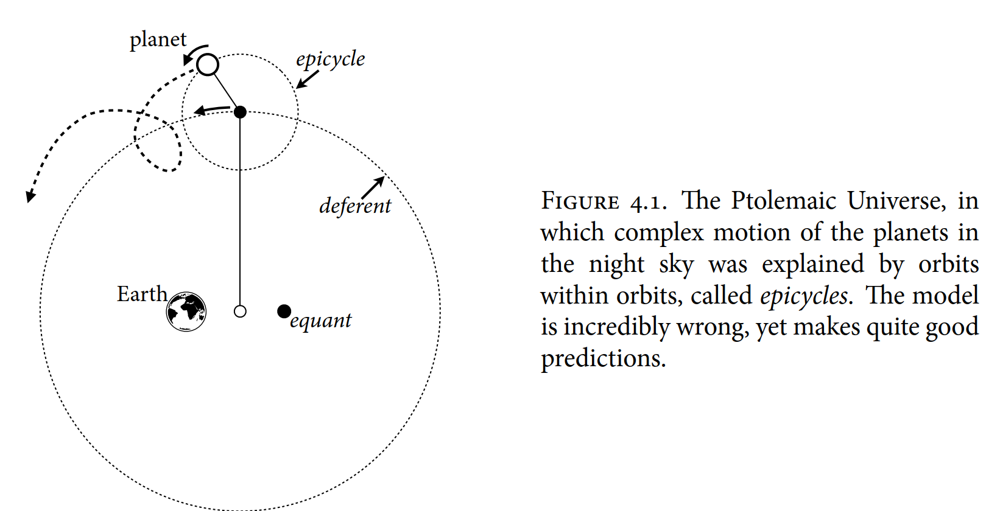
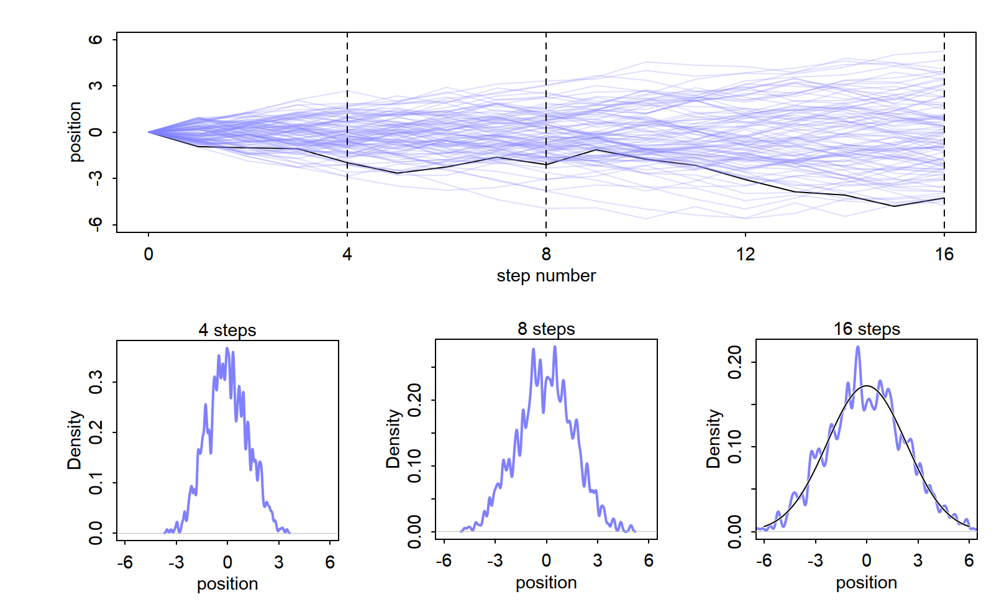
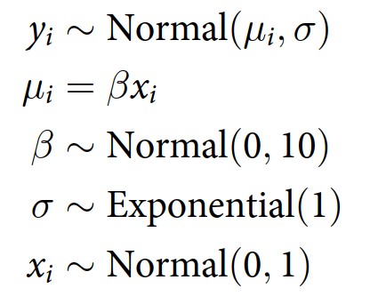
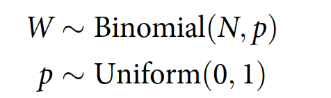

# introduction

```{r}
library(rethinking)
```

歴史はプトレマイオスに対してあまり優しくありませんでした。クラウディオス・プトレマイオス（西暦90年生まれ、168年没）はエジプトの数学者であり天文学者で、太陽系の地球中心モデルで最もよく知られています。今日では、科学者が誰かをからかいたいとき、その人を地球中心説の支持者になぞらえることがあります。しかしプトレマイオスは天才でした。彼の惑星運動の数学モデル（図4.1）は非常に高い精度を誇っていました。その精度を達成するために、「周転円（エピサイクル）」と呼ばれる仕組み、つまり円の上に円を描く方法を用いました。さらにその上に円を重ねること、つまり「円の上の円の上の円」といった構造も可能です。適切な場所に十分な数の周転円を配置すれば、プトレマイオスのモデルは、それ以前の誰よりも高い精度で予測を行うことができました。そのため、このモデルは1000年以上にわたって利用されました。そしてプトレマイオスや彼のような人々は、何世紀にもわたりコンピュータの助けなしにこの体系を作り上げたのです。誰でもプトレマイオスと比較されれば光栄に思うべきでしょう。



もちろん問題は、地球中心モデルが多くの点で間違っていることです。もしそれを使って火星探査機の軌道を計算したなら、かなり離れた場所を通り過ぎてしまうでしょう。しかし夜空で火星を見つけるためには、依然として優れたモデルです。どの天体を観測したいかにもよりますが、100年ごとくらいに再調整する必要があります。それでも、問いの範囲が限定されている限り、地球中心モデルは有用な予測を続けることができます。

周転円を使うという戦略は、太陽系の正しい構造を知ってしまうと奇妙に思えるかもしれません。しかし実際には、古代の人々は一般化された近似の方法に到達していたのです。十分な数の円を適切に組み込めば、プトレマイオスの方法はフーリエ級数と同じになります。これは周期関数（例えば軌道）をサイン関数とコサイン関数の和に分解する方法です。したがって、実際の惑星や衛星の配置がどのようなものであっても、夜空におけるその運動を記述する地球中心モデルを構築することができるのです。

**線形回帰**は、応用統計学における地球中心モデルのようなものです。ここで「線形回帰」とは、ある測定値の平均や分散について学ぼうとする単純な統計的ゴーレム（モデル）の一群を指し、それらは他の測定値の加法的な組み合わせを用いて表現されます。地球中心説と同様に、線形回帰は非常に多様な自然現象を有用に記述することができます。また同様に、線形回帰は多くの異なるプロセスモデルに対応する「記述モデル」です。その構造をあまりにも文字通りに解釈すると、誤りを犯しやすくなります。しかし賢く使えば、こうした小さな線形ゴーレムは依然として有用であり続けます。

この章では、線形回帰をベイズ的手続きとして導入します。ベイズ的な分析に必要な確率的解釈のもとでは、線形回帰はガウス分布（正規分布）を用いて、関心のある測定値に対するゴーレムの不確実性を表現します。この種のモデルは単純で柔軟であり、広く使われています。すべての統計モデルと同様に、万能ではありません。しかし線形回帰は基礎的な方法であると強く主張できます。というのも、一度線形回帰モデルの構築と解釈を学べば、より正規分布から外れた他の種類の回帰へと、より容易に進むことができるからです。

# 4.1 なぜ正規分布は「正規」なのか

あなたと親しい友人1000人が、サッカー場のハーフウェーラインに一列に並んでいると想像してください。全員が手にコインを持っています。笛の合図で、コインを投げ始めます。コインが表なら、その人は左側のゴールに向かって1歩進みます。裏なら右側のゴールに向かって1歩進みます。各人はコインを16回投げ、その結果に従って移動し、最後に立ち止まります。そして、ハーフウェーラインからの距離を測定します。

このとき、1000人のうちどれくらいの割合がハーフウェーライン上にいると予測できるでしょうか？では、ラインから5ヤード左にいる割合はどうでしょうか？

個々の人がどこにたどり着くかを正確に言い当てるのは難しいですが、全体としてどのような分布になるかはかなりの確信をもって言えます。距離はおおよそ正規分布、すなわちガウス分布に従って分布します。これは、基礎となる分布が二項分布であるにもかかわらず成り立ちます。その理由は、左と右の動きがちょうど打ち消し合って合計がゼロになるような並び方の数が非常に多いからです。そこから1歩だけ左または右にずれる並び方は少し減り、さらに離れるほど可能な並び方の数は減少していきます。この減少の仕方が、正規分布特有の「ベル型曲線」を生み出します。

## 4.1.1 足し合わせによる正規性

この結果を、Rでこの実験をシミュレーションすることで確認してみましょう。コイン投げ自体に特別な性質があるわけではないことを示すために、各ステップがそれぞれ異なるものだと仮定します。つまり各ステップは0から1ヤードの間のランダムな距離とします。したがって、コインを投げ、指示された方向に0から1ヤードの距離だけ進み、この過程を繰り返します。

これをシミュレーションするために、各人について −1 から 1 の間のランダムな数を16個生成します。これが各ステップに対応します。そして、それらを足し合わせて16ステップ後の位置を得ます。この手続きを1000回繰り返します。こうした作業はクリック操作のインターフェースでは大変ですが、コマンドラインなら簡単です。次の1行で全て実行できます：

```{r}
pos <- replicate(1000, sum(runif(16, -1, 1)))
plot(density(pos))
```

最終位置の分布は、`hist(pos)` や `plot(density(pos))` など、さまざまな方法で描画できます。図4.2では、これらのランダムウォークの結果と、ステップ数が増えるにつれて分布がどのように変化するかを示しています。上のパネルには、100個の独立したランダムウォークが描かれており、そのうち1つが黒で強調されています。縦の破線は、下の分布図に対応する位置を示しており、それぞれ4ステップ、8ステップ、16ステップ後の分布です。



最初は位置の分布はばらばらに見えますが、16ステップ後にはすでに見慣れた形になっています。ランダムさの中から、ガウス分布の特徴的な「ベル型曲線」が現れてきます。さらにステップ数を増やして試してみると、分布がガウス分布へと収束していくことが確認できるでしょう。ステップの大きさを二乗したり、さまざまに変換しても結果は変わりません。正規性は自然に現れるのです。では、それはどこから来るのでしょうか？

同じ分布からのランダムな値を足し合わせていくようなあらゆる過程は、正規分布に収束します。しかし、なぜ「足し合わせる」ことでベル型の分布になるのかを直感的に理解するのは簡単ではありません。ここでは、その過程を概念的に考える方法を示します。

元の分布の平均値が何であれ、そこから得られる各サンプルは、その平均からの「ゆらぎ（偏差）」とみなすことができます。これらのゆらぎを足し合わせていくと、それらは互いに打ち消し合うようになります。大きな正のゆらぎは、大きな負のゆらぎによって打ち消されます。和に含まれる項が多くなるほど、それぞれのゆらぎが他のゆらぎ、あるいは反対方向の小さなゆらぎの組み合わせによって打ち消される機会が増えます。

その結果、最終的に最も起こりやすい和（つまり、それを実現する方法の数が最も多い和）は、すべてのゆらぎが互いに打ち消し合った状態、すなわち平均に対してゼロの和になります。

基礎となる分布の形は問題ではありません。先ほどの例のように一様分布でもよいし、ほぼどんな分布でもかまいません。分布によって収束の速さは異なるかもしれませんが、収束そのものは避けられません。多くの場合、この例のように収束は速く起こります。

## 4.1.2 掛け算による正規性

正規分布を得るもう一つの方法を見てみましょう。ある生物の成長率が、12個の遺伝子座（ローカス）によって影響されていると仮定します。それぞれのローカスには、成長を促進する複数の対立遺伝子があります。さらに、これらすべてのローカスが互いに相互作用し、それぞれが成長率を「割合」で増加させるとします。つまり、それらの効果は足し算ではなく掛け算で結合されます。例えば、この例のランダムな成長率は次のコードでサンプルできます：

```{r}
prod(1 + runif(12, 0, 0.1))
```

このコードは、1.0から1.1の間のランダムな数を12個生成します。それぞれは成長率の割合的な増加を表しています。したがって、1.0は成長なし、1.1は10%の増加を意味します。そして、この12個の値の積を計算して出力します。では、このようなランダムな積はどのような分布になるでしょうか？これを1万回生成してみましょう：

```{r}
growth <- replicate(10000, prod(1 + runif(12, 0, 0.1)))
dens(growth, norm.comp = TRUE)
```

このコードをRで実行すると、分布が再びおおよそ正規分布になることがわかります。先ほど、正規分布はランダムなゆらぎを足し合わせることで生じると言いましたが、それは正しいです。**しかしここでは、各ローカスの効果は足し算ではなく掛け算で結合されています。では、なぜ同じように正規分布が現れるのでしょうか？**

**それは、各ローカスの効果が非常に小さいからです。小さな数の掛け算は、近似的には足し算と同じになります。**例えば、2つのローカスがそれぞれ10%の成長増加をもたらす場合、その積は：

1.1 × 1.1 = 1.21

となります。

これを増加分の足し算で近似すると、誤差はわずか0.01にとどまります：

1.1 × 1.1 = (1 + 0.1)(1 + 0.1) = 1 + 0.2 + 0.01 ≈ 1.2

各ローカスの効果が小さいほど、この加法的な近似はより良くなります。このように、掛け合わされる小さな効果は近似的に足し算として扱えるため、結果としてガウス分布に収束する傾向があります。次のように比較して確かめてみてください：

```{r}
big <- replicate(10000, prod(1 + runif(12, 0, 0.5)))
small <- replicate(10000, prod(1 + runif(12, 0, 0.1)))
dens(big, norm.comp = TRUE)
dens(small, norm.comp = TRUE)
```

相互作用する成長の偏差は、それが十分に小さい限り、ガウス分布へと収束します。このように、ガウス分布へと向かう因果的な力の範囲は、単純な加法的相互作用をはるかに超えて広がっています。

## 4.1.3 対数による掛け算の正規性

しかし、まだ話は続きます。大きな偏差同士を掛け合わせる場合、それ自体はガウス分布を生みませんが、対数スケールで見るとガウス分布になる傾向があります。例えば：

```{r}
log.big <- replicate(10000, log(prod(1 + runif(12, 0, 0.5))))
dens(log.big, norm.comp = TRUE)
```

ここでもガウス分布が現れます。対数を足し合わせることは、元の数値を掛け合わせることと等価だからです。したがって、大きな偏差の掛け算的な相互作用であっても、結果を対数スケールで測定すればガウス分布を生み出すことができます。測定尺度は任意に選べるものなので、このような変換に不自然さはありません。実際、音や地震、さらには情報（第7章）などを対数スケールで測定するのは自然なことです。

## 4.1.4 ガウス分布の利用

この章の残りでは、ガウス分布を仮説の骨格として用い、正規分布の集まりとして測定値のモデルを構築していきます。ガウス分布を用いる正当化は、大きく2つに分けられます：(1) 存在論的理由（ontological）と (2) 認識論的理由（epistemological）です。

### 4.1.4.1 存在論的正当化

世界はおおよそガウス分布に満ちています。数学的な理想化として、完全に正確なガウス分布を経験することはありません。しかし、それはさまざまなスケールや領域で何度も現れる広く見られるパターンです。測定誤差、成長のばらつき、分子の速度などは、いずれもガウス分布へと近づく傾向があります。これは、**これらの過程の本質が「ゆらぎの足し合わせ」であるためです。そして有限のゆらぎを何度も足し合わせると、その和の分布は平均と広がり（分散）以外の情報をほとんど失った形になります**。

**このことの一つの帰結は、ガウス分布に基づく統計モデルは、ミクロな過程を信頼できる形で特定することができない、という点です。これは第1章（6ページ）で述べたモデリングの哲学を思い起こさせます。しかし同時に、これらのモデルは過程を特定できなくても有用な仕事ができることも意味します。もし身長の統計モデルを作る前に、その発生の生物学的過程を完全に理解しなければならないとしたら、人間の生物学は成り立たないでしょう**。

自然界には他にも多くのパターンが存在するので、ガウス分布が普遍的であると考えるのは誤りです。後の章では、指数分布やガンマ分布、ポアソン分布といった他の有用で一般的な分布も、自然な過程から生じることを見ていきます。ガウス分布は「指数型分布族（exponential family）」と呼ばれる基本的な自然分布の一群の一員です。この族のすべての分布は、現実世界に現れるため、実際の科学にとって重要なのです。

### 4.1.4.2 認識論的正当化

しかし、ガウス分布が自然界に現れるという事実は、それをモデルの基礎として採用する理由の一つにすぎません。ガウス分布を「骨格」として正当化するもう一つの方法、そして後にそれがしばしば適切でない理由を理解する助けにもなる考え方は、それが「ある特定の無知の状態」を表現しているという点にあります。**もし、ある測定値の分布（測定値とは実数直線上の連続値のこと）について、私たちが知っている、あるいは仮定してよいのが平均と分散だけであるならば、その仮定と最も整合的なのがガウス分布です。**

**つまり、ガウス分布は私たちの無知の状態を最も自然に表現したものだと言えます**。なぜなら、測定値が有限の分散を持つということ以外に何も仮定しないのであれば、ガウス分布は最も多くの方法で実現され得る形であり、新たな仮定を導入しないからです。これは最も驚きが少なく、最も情報量の少ない仮定です。この意味で、ガウス分布は私たちの仮定と最も整合的な分布です。正確には、私たちのゴーレム（モデル）の仮定と最も整合的なのです。**もし分布がガウスであるべきでないと思うなら、それはあなたが何か追加の情報を知っていることを意味し、その情報をゴーレムに伝えるべきです。それによって推論が改善されるでしょう**。

この認識論的な正当化は、情報理論と最大エントロピーの原理に基づいています。情報理論については第7章で、最大エントロピーについては第10章で詳しく扱います。そして後の章では、他の一般的で有用な分布を用いて一般化線形モデル（GLM）を構築していきます。これらの分布が導入されると、それらがどのような制約のもとで「最も適切（私たちの仮定と整合的）」な分布になるのかが理解できるでしょう。

当面は、ガウス分布に関する存在論的・認識論的な正当化を、測定値のモデルを構築する出発点として受け入れておきましょう。ただし、モデルを使うことは、それを絶対視することと同じではない、という点を忘れないでください。ゴーレムはあなたの道具であり、その逆ではありません。後の章では、ガウス分布を使わない方がよい理由も見ていきます。

### 再考：ヘビーテール

ガウス分布は自然界で非常によく見られ、統計的にも優れた性質を持っています。しかし、それをデフォルトのデータモデルとして使うことにはリスクもあります。分布の両端の部分は「テール（裾）」と呼ばれますが、ガウス分布のテールは非常に薄く、そこにある確率はごく小さいものです。代わりに、ガウス分布の大部分は平均の1標準偏差以内に集中します。

しかし、**多くの自然現象（さらには人工的な現象）では、これよりもはるかに「重いテール」を持つ分布が見られます。つまり、極端な事象が起こる確率がはるかに高いのです。重要な例として金融時系列があります。株式市場の上下動は短期的にはガウス的に見えるかもしれませんが、中長期的には極端なショックが頻発し、ガウスモデル（およびそれを使う人）を滑稽なものにしてしまいます。歴史的な時系列も同様の振る舞いを示すことがあり、例えば戦争の傾向を推論する際には、ヘビーテールな「予想外の出来事」に大きく影響されやすいのです**。

後の章では、ガウス分布の代替となるモデルについても検討します。

# 4.2 モデルを記述するための言語

この本では、統計モデルを記述しコーディングするための標準的な言語を採用します。この言語は多くの統計学の教科書や、ほとんどすべての統計学の学術誌で使われており、ベイズ的モデリングと非ベイズ的モデリングの両方に共通しています。科学者たちもまた、自分たちの統計手法を記述するためにこの言語をますます使うようになっています。したがって、この言語を学ぶことは、今後どの方向に進むにせよ有益な投資となります。

ここでは、抽象的にそのアプローチを説明します。後で多くの例を見ますが、その前に一般的な手順を理解しておくことが重要です。

\(1\) まず、理解したい変数の集合を特定します。そのうちのいくつかは観測可能です。これらを\*\*データ（data）**と呼びます。その他は、率や平均のような観測できない量であり、これらを**パラメータ（parameters）\*\*と呼びます。

\(2\) 各変数について、それを他の変数との関係として、あるいは確率分布として定義します。これらの定義によって、変数間の関連を学ぶことが可能になります。

\(3\) 変数とその確率分布の組み合わせは、\*\*同時生成モデル（joint generative model）\*\*を定義します。これは仮想的な観測データをシミュレーションすることにも、実際のデータを分析することにも使えます。

この枠組みは、天文学から美術史に至るまで、あらゆる分野のモデルに適用されます。最大の難しさは通常、数学ではなく対象そのものにあります。すなわち、どの変数が重要で、それらを理論的にどのように結びつけるか、という点です。

これらの決定をすべて行った後（そして多くはやがて自動的にできるようになります）、モデルは次のような数式で要約されます：

{width="167"}

もしこれがあまり意味をなさないと感じるなら、それで結構です。それは、あなたが正しい教科書を手にしている証拠です。なぜなら、この本はこうした数理モデルの記述を読み書きする方法を教えるものだからです。

ここでは、それらを数式として操作することはしません。むしろ、それらはモデルを明確に定義し、伝えるための曖昧さのない方法を提供します。この文法に慣れてくると、他の本や学術論文でこうした数式的記述を読んだときにも、難解に感じることが少なくなるでしょう。

もちろん、ここで示した方法が統計モデリングを記述する唯一の方法ではありません。しかし、それは広く使われており、生産的な言語です。一度この言語を身につければ、モデルの仮定を伝えることがずっと容易になります。もはや「等分散性（homoscedasticity）」のような、一見すると恣意的で奇妙な条件のリストを覚える必要はありません。なぜなら、それらの条件はモデルの定義から直接読み取れるからです。

さらに、回帰分析や重回帰、ANOVA、ANCOVAといった特定のモデルの型に縛られていると感じることもなくなります。これらはすべて同種のモデルであり、そのことは、モデルを「ある変数の集合から別の変数の集合への、確率分布を通じた写像」として捉えられるようになると明らかになります。根本的には、これらのモデルは、ある変数の値が与えられたときに、別の変数の値がどのように生じるかを定義しているのです（第2章）。

## 4.2.1 地球投げモデルの再記述

例を使って考えるのがよいでしょう。前の章で扱った「水の割合」の問題を思い出してください。そのときのモデルは次のようなものでした：

{width="236"}

ここで、W は観測された水の回数、N は試行回数（投げた回数）、そして p は地球上の水の割合を表します。この式は次のように読みます：

W は標本サイズ N、確率 pの二項分布に従う

p の事前分布は 0 から 1 の一様分布である

**このようにモデルを書くと、その仮定が自動的にすべて明らかになります**。二項分布は各試行（地球投げ）が互いに独立であることを仮定しているので、このモデルもまた、観測データ同士が独立であることを仮定していると分かります。 当面は、このような単純なモデルに焦点を当てます。これらのモデルでは、最初の行がベイズの定理における尤度関数を定義し、残りの行が事前分布を定義します。このモデルの両方の行は、記号「～」が示すように**確率的（stochastic）**です。 確率的関係とは、ある変数やパラメータを分布に対応づけることを意味します。「確率的」と呼ばれるのは、左辺の変数の値が一意に決まっているわけではないからです。代わりに、それは確率的な写像です。つまり、ある値が他の値よりもっともらしいことはあっても、多くの異なる値がどれもあり得るのです。後の章では、決定論的な定義を含むモデルも扱うことになります。
